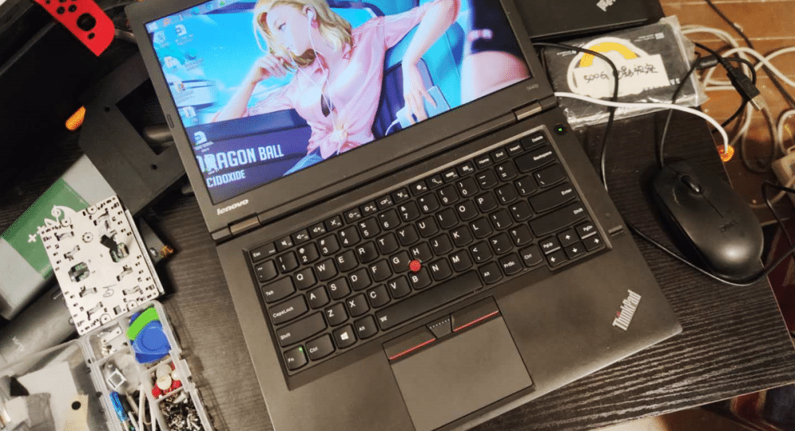
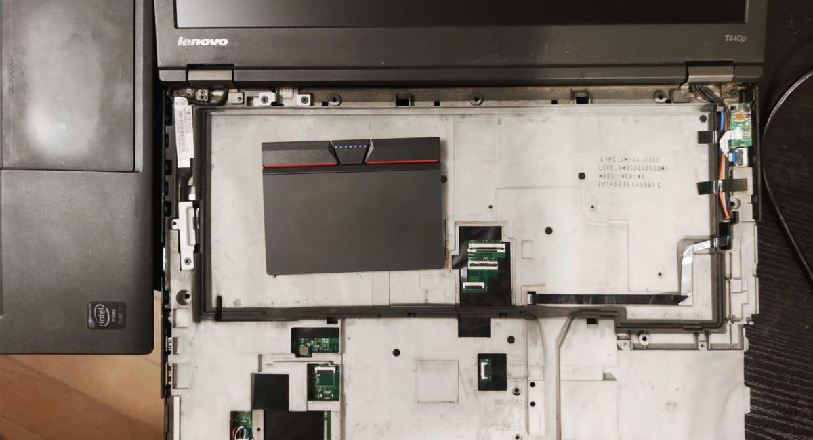
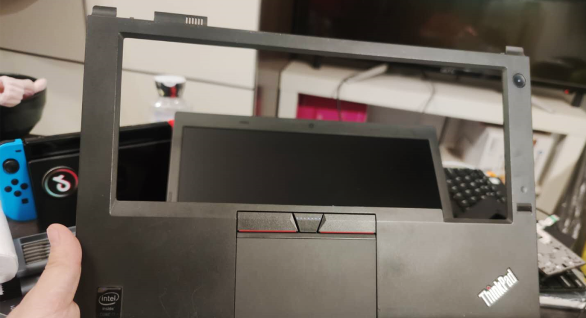

<!--more-->4代系列的一体式触摸板是公认的败笔，好在5代之后就改回三键设计了。并且四五代触摸板可以通换。在闲鱼上收了一个别人拆机的E450的三键触摸板，回来换上，好用。[参考这个教程][1]，先拆键盘，再拆后盖，拿下C框后即可更换，要诀就是胆大心细，别拽断了键盘排线。
换好后别急着上螺丝，先启动看看是否正常。

  [1]: https://blog.csdn.net/guandongsheng110/article/details/80521238