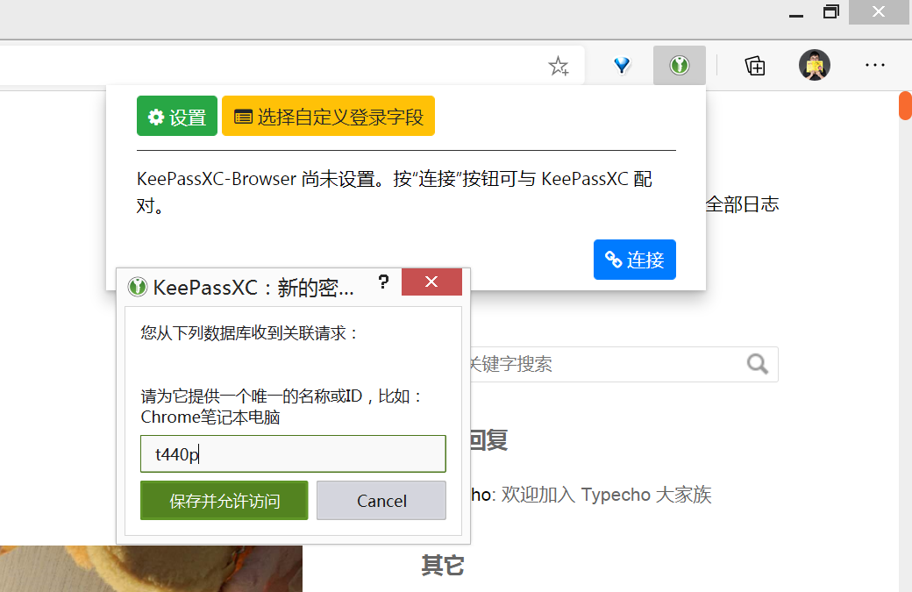

我所有的密码都使用 KeePassXC 管理，此处记录下，如何使用 KeePassXC 的插件，来让 Edge 自动填充密码。
<!--more-->
首先[下载][1] KeePassXC 的 Edge 扩展插件，然后[下载][2]最新版的 KeePassXC。
打开 KeePassXC 设置，点浏览器配合，勾上“启用浏览器集成”。
重启 Edge，再点击扩展图标，就会自动弹出连接数据库的提示，设置一个名字就可以了。
之后，进入各种网站，就会自动填充已经记录的密码。
  [1]: https://microsoftedge.microsoft.com/addons/detail/pdffngciaglkoonimfcmckehcpafo%20%E4%B8%8B
  [2]: http://%20https://keepassxc.org/download/