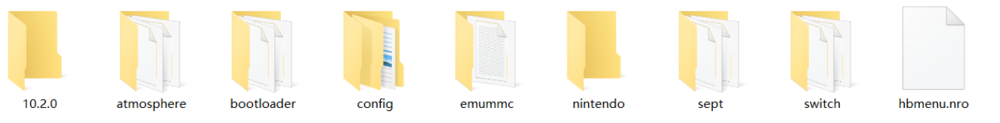

![2020102410484300-57B4628D2267231D57E0FC1078C0596D.jpg][1]
![2020102410490400-57B4628D2267231D57E0FC1078C0596D.jpg][2]
<!--more-->我的是单系统，还有另一台未破机器，供媳妇玩动森，所以这里只记录单系统的操作。所需要的软件已经打包> 链接：https://pan.baidu.com/s/1g6aoRCXZ8Ik724dhUZberA  提取码：fmbk首先，sd卡保留Nintendo和emummc（没有这个是单系统，不用理会）其余都删除，放心操作，不会删除游戏和存档，然后，解压10.2.0和0.14.4压缩包，解压后放sd卡根目录。如下图。然后开机，进入 Daybreak，选固件所在的文件夹，一路默认，直到 Installing update 后，重启即可。其它版本的固件以此类推，在[这里][3]下载（switch-firmwares）。

  [1]: ../assets/2020/10/3617053810.jpg
  [2]: ../assets/2020/10/1635009715.jpg
  [3]: https://darthsternie.net/switch-firmwares/