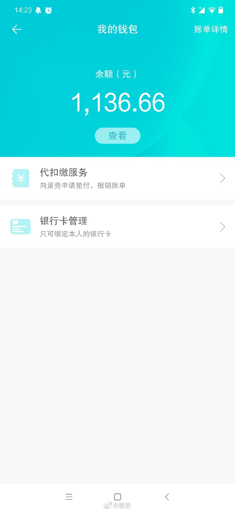

#蛋壳公寓[超话]#蛋壳钱包里还有1000多块，没法提现。还有3500的押金，估计也退 不出来了。从15年底到现在，住了五年蛋壳，除因客厅的隔断被居委会卸过几次电 表，以及最近频繁断网外，其它感觉还是挺好的。 造成蛋壳今天的局面，我认为除了天灾，也有人祸：120平的三居，把客厅隔成卧 室，改成四居，我真不认为有什么问题。 就因为拆除这间房子，蛋壳每间房至少损失三四千，对这么大体量的公司来说，无疑 雪上加霜。 希望蛋壳能度过危机，不是因为我这几千块钱，而是它确实帮年轻人解决了住房问 题。毕竟如果没有蛋壳和自如，将来大家要面对的，还是无穷无尽的黑中介。 最后说一句，如果你的房子是租来的，那么你的生活也一定是租来的，稳定的生活随 时都有可能因为别人的一句话，而灰飞烟灭。

