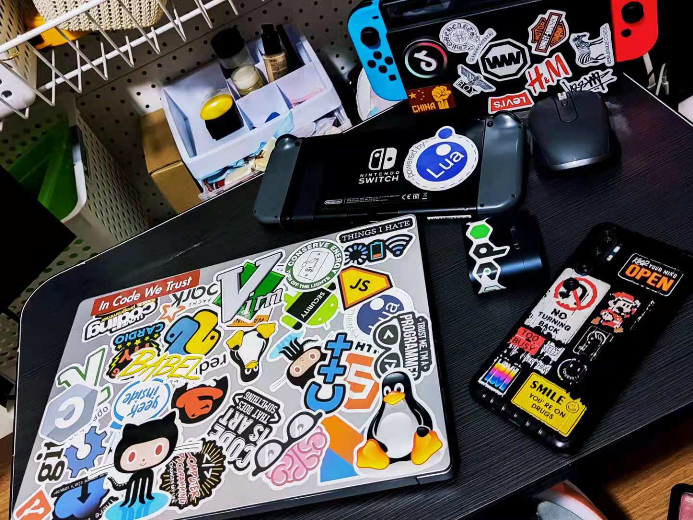
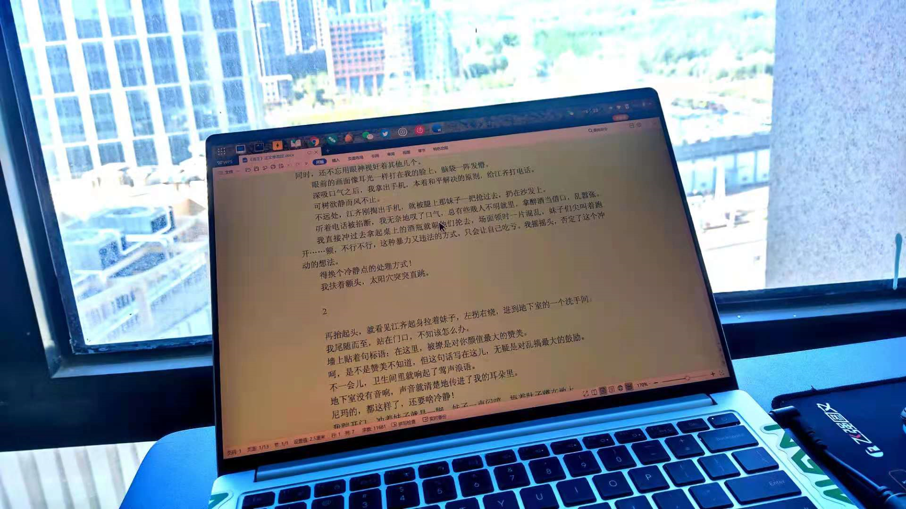

<!--more-->机械革命S2 Air曾给我留下很深刻的印象，不过今年的F1显然更猛，第一感觉就是这个屏幕边框，实在是太窄了，看习惯了这机器90Hz的刷新率，也让人无法再回过去适应60Hz了。但最惊讶的还是这个屏幕色彩，怎么看怎么舒服，还是难得的雾面屏。
然后就是，太轻了，机械革命现在把铝镁合金都快玩出花了，在这么轻薄的前提下，还保留了两个C口（左右C口都能充电），一个DC口，两个A口，一个HDMI。
丰富的接口，超薄的尺寸，惊艳的屏幕，真好。
但唯独不爽的是这个电池，满电也只能用三个小时，非常遗憾。
