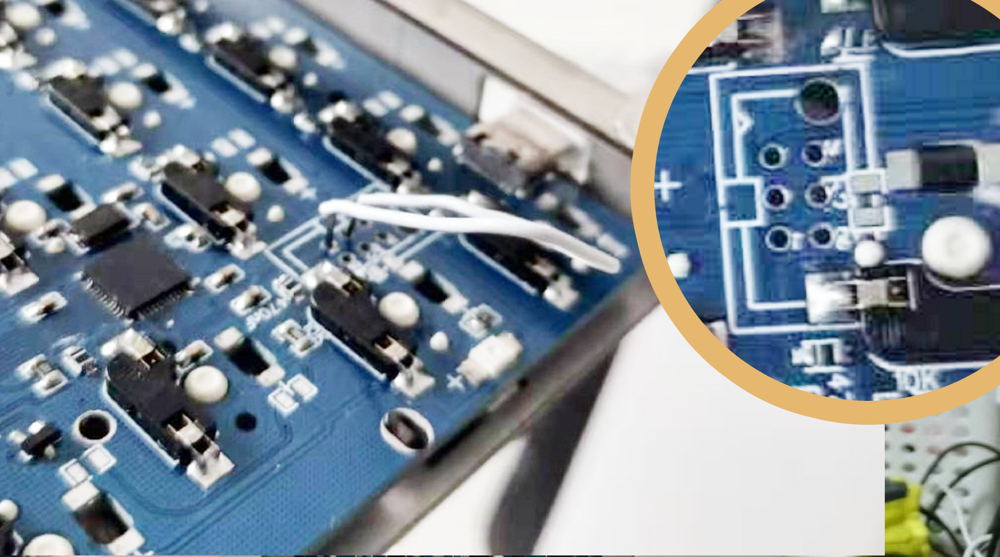

![Snipaste_2021-06-07_23-26-40.png][1]
<!--more-->
在b站看到有人安利40配列的键盘，就想试试看，到手后发现，一时半会真得很难用习惯，不光是按键少，主要还是键盘整体太小，手腕的负担比较大。更悲剧的是，刷固件时忘记设置 RESET 键了，导致无法进入刷机模式，折腾好半天才搞好。在此做个记录。刷固件前，先打开 QMK Tools 工具，然后按下键盘的 RESET 键，进入 DFU 模式刷机，如果设置了 RESET 键，你直接按下就好了，但如果跟我一样，忘记设置了，那就需要找一个铁镊子，或者其它能导电的东西，我是找了一个别针，把外面的保护层剪掉了，露出里面的金属丝。
然后，观察你的 PCB，应该会在背后看到有6个洞，然后用别针分别连接两个洞，把它们短接——具体是哪两个洞，似乎每个板子都不一样？ 我看说什么的都有，反正在瞎捅之后，我终于听到电脑识别新硬件的声音了。
![Snipaste_2021-06-07_23-03-47.png][2]现在之后再刷固件，就可以正常写入了，这才一定记得设置 RESET 键，省得之后再折腾。
  [1]: ../assets/2021/06/4266211283.png
  [2]: ../assets/2021/06/4264510983.png