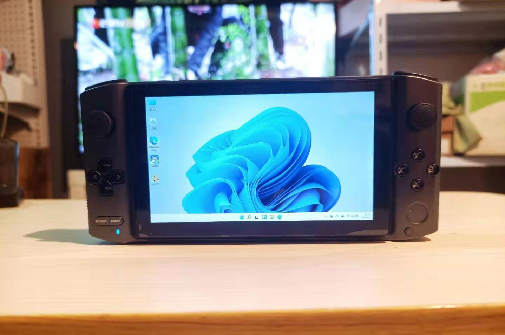
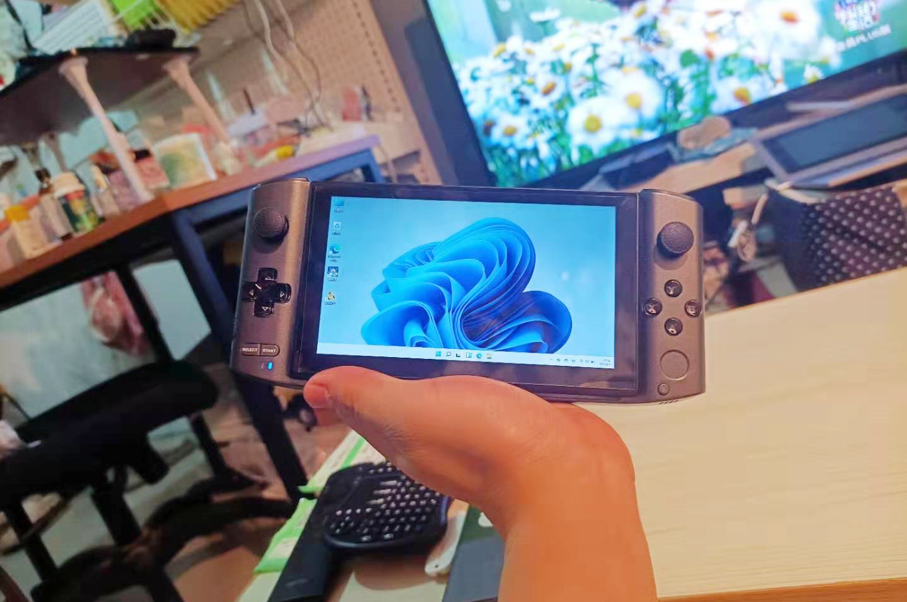

<!--more-->
出于对 umpc 的喜爱，买了win3，其实不是用来玩游戏，还是希望能做到轻装上班的体验，但这个屏太小了，所以又买了个 tnt go，想来当外接显示器+键盘，简单说说体验。
首先 tnt go 很重，单机器的体积就相当于我机械革命f1的重量了，再加上 600 多克的 win3，组合下来并不轻。
然后就是 tnt go 的亮度，严重依赖键盘，拿下键盘后就无法调亮度了，这点很不方便。
最后也是最重要的问题是，tnt go 无法做到一线通，也就是说，使用它当外接显示器时，需要额外再加一根线给它供电，而 win 3 本身也需要供电，所以如果想组合使用的话，就需要3根线，一根连接两台机器，传输视频信号；然后每台机器再单独一根供电线，额外说一句，win 3 本身也只有一个 type C 接口，所以如果边充电边连外接显示器的话，要么用底座，要么用扩展坞……
这样一折腾下来，感觉还不如直接用一台笔记本来的方便呢。