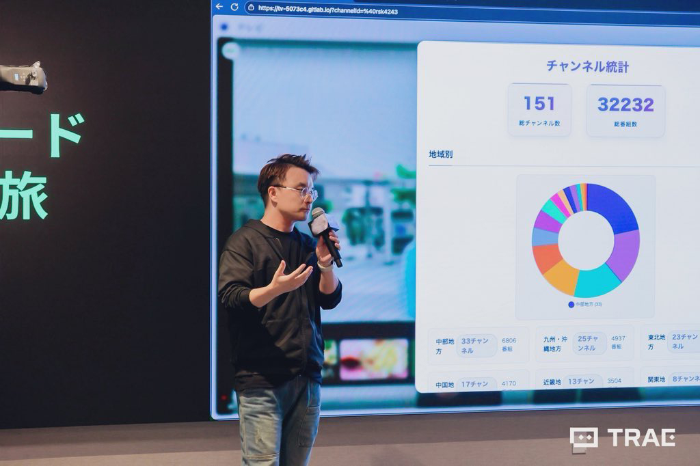

2025年9月27日、東京で開催されたByteDance（バイトダンス）TRAEチーム主催の「Vibe Coding Journey」イベントで、初めて日本語で登壇する機会をいただきました。

今回の発表テーマは、自作している日本語ビデオツール「Terebi」について。参加者の皆さんの前で、開発のモチベーションやツールの特徴、日本語学習者として工夫したポイントなどを紹介しました。

日本語を本格的に学習し始めて約1年。正直、自分の話す日本語が伝わるかとても不安で、プレゼンの直前まで何度も原稿を読み直しました。当日も緊張で声が震えましたが、温かい雰囲気のおかげでなんとかやり切ることができました。

#### 印象に残ったこと

- 準備段階からスライド、スクリプト、発音と、一つ一つ丁寧に確認。伝える言葉を何度も自分で練習し直した
- 質疑応答では参加者から日本語学習やツール開発について色々質問していただき、嬉しかった
- 同じ日本語学習者の方と交流できるきっかけに

登壇を通して、間違えることを恐れず「伝えたい」を大事にする勇気をもらった気がします。支えてくれた主催チームや参加者のみなさん、本当にありがとうございました！

これからももっと日本語で表現したいし、Terebiも引き続き改善していきます。